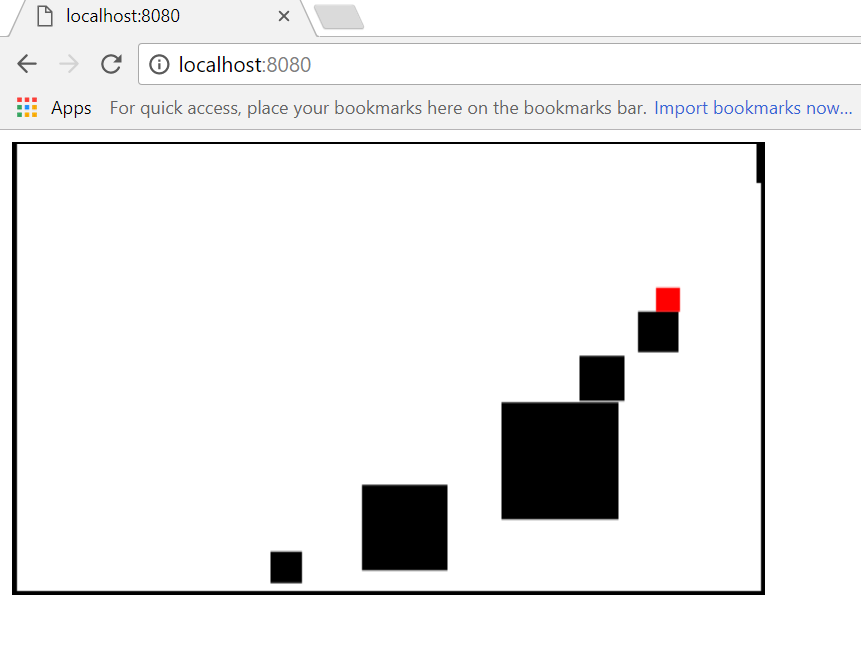

# a simple platform game with HTML 5

I have never written a game. At least not since the 1980s.

So this is my new HTML 5 game.

## HTML 5 Game Tutorials

http://www.somethinghitme.com/ has a good tutorial on HTML5 games
[here](http://www.somethinghitme.com/) from which I knicked most of
this code.

The thing I like about it is that it's incredibly simple and
understandable. I don't want a complex game engine.

I suspect if I'd had one even the simple thing that I did with it
(allowing the "world" to be created by the player) would have been
more difficult.

somethinghitme also references
[this](http://www.lostdecadegames.com/how-to-make-a-simple-html5-canvas-game/)
tutorial which goes into more depth in some areas.

There's also
[this](http://www.williammalone.com/articles/create-html5-canvas-javascript-sprite-animation/)
on sprites and how they tie into the animation loop.

I haven't done sprites yet but I hope to give it a go.

## How to play this game

The object is to get to the door which is placed on the top of the
game area at the left or right, randomly.

You need to make blocks to jump on to get there.

You move with cursors (up is jump) and make a block with "b".

The longer you hold "b" the bigger the resulting block will be, up to
a limit.

The block will be created in the direction in which you're
facing. Even though you're just a dot and you can't tell which way
you're facing.
